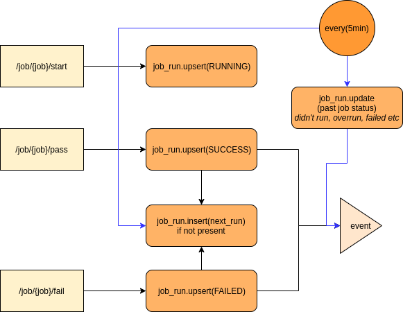
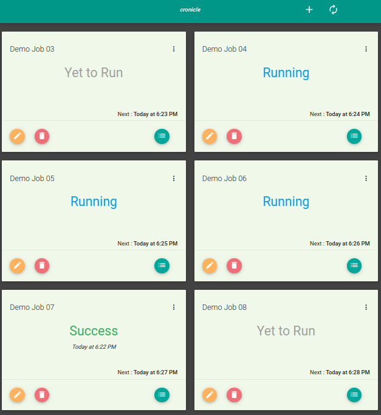
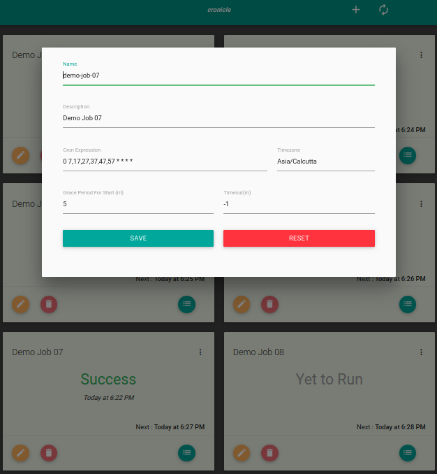
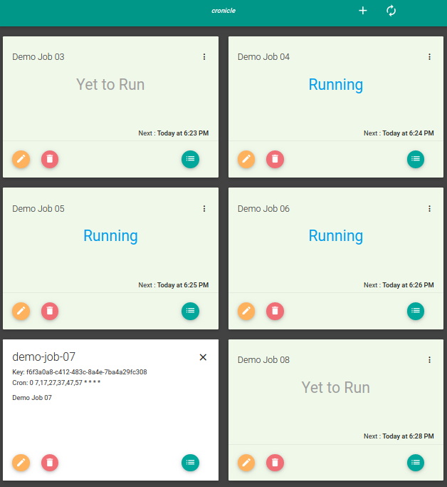
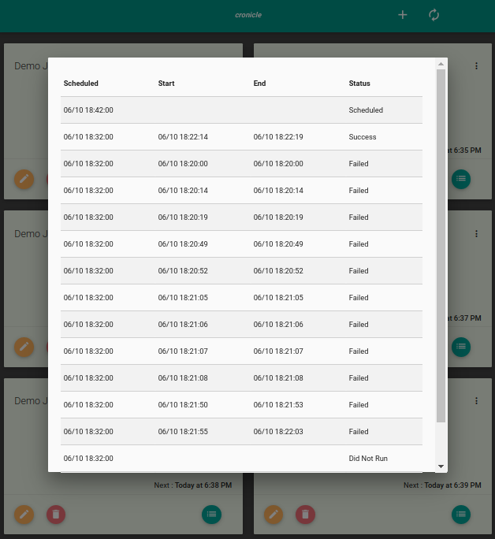

# Cronicle

A simple Spring Boot Java server to keep track of whether your cron jobs ran or not. There are many paid
services that do this, but I found it too expensive for doing such a thing.
Also, wanted to get muscle memory refreshed on typing in Java code :)

At just about 1000 sloc (<700 for Java; rest for HTML), it is meeting my needs pretty well. Feel free to 
fork and use/change it.

For screenshots of the simpleton UI, see below. This is the UI from the demo
script that setups up jobs for you.

## Design

There are two tables viz., `job` and `job_run`. `job` holds the crons and
`job_run` is a child table that has past runs and *one* future runs record added
for each job. State machine for `job_run` is like below.

* UNSCHEDULED -> SCHEDULED
* SCHEDULED -> RUNNING
* RUNNING -> SUCCESS 
* RUNNING -> FAILED
* SCHEDULED -> DID_NOT_RUN
  
There is one cron inside the JVM that marks old jobs that didn't get to
a terminal state, as FAILED or DID_NOT_RUN.

You will need to call APIs to mark your job as started or finished. See
the script `cronicle_client_wrapper.sh` to just wrap your existing job in your
crontab entry with minimal effort.

Finally, when a `job_run` gets into terminal state via API or via cron inside
the JVM, it raises a reactor event. You can add your own program in property
file to be called on this event. 

## Installation

* Build like `gradle buildDistZip`
* Distribution is in `build/distributions`
* Take `sample/application.properties` in the distribution to root of your installation and edit it. Default DB is h2; in `tmp` folder!
  If you want to change to mysql or postgres, change `build.gradle` to add dependencies and to edit property file with correct connect strings and credentials.
* Run `bin/cronicle`

## Quick Demo
* Install `jq`  and `curl` utilities
* Unzip the distribution somewhere
* Setup `application.properties` and run `bin/cronicle`
* Go to http://localhost:8080/ - once you get the UI
* Run `cd demo; setup_demo_jobs.sh`
* Add the output to your crontab
* After a while, check the UI again - you should see status getting updated

**Regular Job View**

**Edit Job** (plus to create new, pencil to edit)

**Get Job Key** (hamburger menu)

**View Runs of a Job** (menu icon at the bottom of the card)

## Usage

* Add a cron job using the UI. UI is a quick hack SPA :)
* Note  the guid of the job
* Change your cron job to run inside `cronicle-client-wrapper.sh`. See that script for usage.
  * This means, if your crons are in another machine, you need to copy over the wrapper script there
    and ensure that machine can do http connections to where this is running.
* If you want, you can enable event processing by setting your handler in `application.properties`.
  * Sample is given in `sample-event-handler.sh`. Bbe careful to make that program non-blocking.  For example, if you are sending a mail there, you should handle exiting quickly if email server is taking lot of time.

## Todo

* Fix the "Yet to Run" marker on the UI - it is overly convoluted
* relying on guid isn't quite secure unless you've access limited to intranet.
  At least add basic auth.
* move schedule future to an api and call it on cron status changed event or created
* job cleaner only does timeout and not run marking
* Fix long running logic
* UI fixes; add/edit/delete; auto refresh; backbone.js

